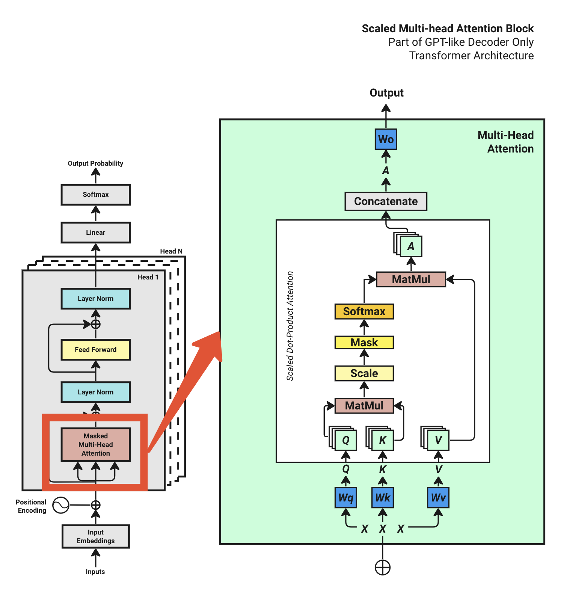

# 第 18 章：手写 Model.py


> **一句话总结**：模型代码就是把我们前面学的所有组件（Embedding、Positional Encoding、Multi-Head Attention、FFN、LayerNorm）用 PyTorch 串起来。每个类对应一个组件，每行代码都有对应的数学公式。

> 📦 **完整代码仓库**：[github.com/waylandzhang/Transformer-from-scratch](https://github.com/waylandzhang/Transformer-from-scratch)

---

## 18.1 写代码之前：整体结构

### 18.1.1 我们要实现什么？

```
Model (完整模型)
├── Token Embedding (词嵌入)
├── Positional Encoding (位置编码)
├── N × TransformerBlock (多个 Transformer 块)
│   ├── LayerNorm
│   ├── Multi-Head Attention
│   ├── LayerNorm
│   └── Feed Forward Network
├── Final LayerNorm (最后的归一化)
└── Output Linear (输出投影到词表)
```

### 18.1.2 代码文件结构

我们把所有模型代码放在一个文件 `model.py` 中：

```
# model.py 整体结构
import math
import torch
import torch.nn as nn
from torch.nn import functional as F

class FeedForwardNetwork(nn.Module):     # FFN 前馈网络
    ...

class Attention(nn.Module):              # 单头注意力
    ...

class MultiHeadAttention(nn.Module):     # 多头注意力
    ...

class TransformerBlock(nn.Module):       # Transformer 块
    ...

class Model(nn.Module):                  # 完整模型
    ...
```

---

## 18.2 Feed Forward Network（前馈网络）

### 18.2.1 回顾 FFN 结构

在第 15 章我们学过，FFN 是一个简单的两层全连接网络：

```
输入 [batch, seq, d_model]
     ↓
Linear1: d_model → d_model × 4
     ↓
ReLU 激活
     ↓
Linear2: d_model × 4 → d_model
     ↓
Dropout
     ↓
输出 [batch, seq, d_model]
```

**维度先扩大 4 倍，再缩回来**。这是让模型有更强的表达能力。

### 18.2.2 代码实现

```
# 定义前馈网络 Feed Forward Network
class FeedForwardNetwork(nn.Module):
    def __init__(self, d_model, dropout):
        super().__init__()
        self.d_model = d_model
        self.dropout = dropout
        self.ffn = nn.Sequential(
            nn.Linear(self.d_model, self.d_model * 4),  # 扩展 4 倍
            nn.ReLU(),                                   # 激活函数
            nn.Linear(self.d_model * 4, self.d_model),  # 缩回原维度
            nn.Dropout(self.dropout)                     # 随机丢弃
        )

    def forward(self, x):
        return self.ffn(x)
```

### 18.2.3 代码解读

| 代码 | 作用 | 维度变化 |
| --- | --- | --- |
| `nn.Linear(d_model, d_model * 4)` | 第一层全连接 | `[B,T,512] → [B,T,2048]` |
| `nn.ReLU()` | 激活函数，引入非线性 | 不变 |
| `nn.Linear(d_model * 4, d_model)` | 第二层全连接 | `[B,T,2048] → [B,T,512]` |
| `nn.Dropout(dropout)` | 随机丢弃，防止过拟合 | 不变 |

---

## 18.3 Attention（单头注意力）

### 18.3.1 回顾 Attention 公式

textAttention(Q,K,V)=textsoftmaxleft(fracQKTsqrtdkright)V\\text{Attention}(Q, K, V) = \\text{softmax}\\left(\\frac{QK^T}{\\sqrt{d\_k}}\\right)VtextAttention(Q,K,V)=textsoftmaxleft(fracQKTsqrtdk​right)V

在代码里，我们需要实现：

1. 生成 Q、K、V（通过线性变换）
2. 计算注意力分数（Q @ K^T）
3. 缩放（除以 √d\_k）
4. 应用 Causal Mask（防止看到未来）
5. Softmax 归一化
6. 与 V 相乘得到输出

### 18.3.2 代码实现

```
# 定义单头注意力 Scaled Dot Product Attention
class Attention(nn.Module):
    def __init__(self, d_model, head_size, context_length, dropout):
        super().__init__()
        self.d_model = d_model
        self.head_size = head_size
        self.context_length = context_length
        self.dropout = dropout

        # Q、K、V 的线性变换
        self.Wq = nn.Linear(self.d_model, self.head_size, bias=False)
        self.Wk = nn.Linear(self.d_model, self.head_size, bias=False)
        self.Wv = nn.Linear(self.d_model, self.head_size, bias=False)

        # Causal Mask：下三角矩阵
        self.register_buffer('mask', torch.tril(torch.ones(self.context_length, self.context_length)))

        self.dropout = nn.Dropout(self.dropout)

    def forward(self, x):
        B, T, C = x.shape  # Batch, Time(seq_len), Channels(d_model)

        # 1. 生成 Q, K, V
        q = self.Wq(x)  # [B, T, head_size]
        k = self.Wk(x)  # [B, T, head_size]
        v = self.Wv(x)  # [B, T, head_size]

        # 2. 计算注意力分数 Q @ K^T，并缩放
        weights = (q @ k.transpose(-2, -1)) / math.sqrt(self.head_size)
        # weights: [B, T, T]

        # 3. 应用 Causal Mask（未来位置设为 -inf）
        weights = weights.masked_fill(self.mask[:T, :T] == 0, float('-inf'))

        # 4. Softmax 归一化
        weights = F.softmax(weights, dim=-1)

        # 5. Dropout
        weights = self.dropout(weights)

        # 6. 与 V 相乘
        output = weights @ v  # [B, T, head_size]

        return output
```

### 18.3.3 关键代码解读

**Causal Mask 的作用**：

```
self.register_buffer('mask', torch.tril(torch.ones(context_length, context_length)))
```

`torch.tril` 生成下三角矩阵：

```
[[1, 0, 0, 0],
 [1, 1, 0, 0],
 [1, 1, 1, 0],
 [1, 1, 1, 1]]
```

位置 i 只能看到位置 0 到 i，不能看到 i+1 及之后。这就是为什么叫 **Causal**（因果）Mask。

**为什么用 `register_buffer`？**

Mask 不是参数（不需要训练），但需要跟模型一起移动到 GPU。`register_buffer` 就是专门干这个的。

---

## 18.4 Multi-Head Attention（多头注意力）

### 18.4.1 多头的思路

多头注意力 = **多个单头注意力并行运行，最后拼接**。

每个头关注不同的"视角"，最后合起来得到更丰富的表示。

### 18.4.2 代码实现

```
# 定义多头注意力 Multi-Head Attention
class MultiHeadAttention(nn.Module):
    def __init__(self, d_model, num_heads, head_size, context_length, dropout):
        super().__init__()
        self.d_model = d_model
        self.num_heads = num_heads
        self.head_size = head_size
        self.context_length = context_length
        self.dropout = dropout

        # 创建多个注意力头
        self.heads = nn.ModuleList([
            Attention(self.d_model, self.head_size, self.context_length, self.dropout)
            for _ in range(self.num_heads)
        ])

        # 输出投影层 Wo
        self.projection_layer = nn.Linear(self.d_model, self.d_model)
        self.dropout = nn.Dropout(self.dropout)

    def forward(self, x):
        # 并行运行所有头
        head_outputs = [head(x) for head in self.heads]

        # 拼接所有头的输出
        head_outputs = torch.cat(head_outputs, dim=-1)  # [B, T, num_heads * head_size] = [B, T, d_model]

        # 通过输出投影层
        out = self.dropout(self.projection_layer(head_outputs))

        return out
```

### 18.4.3 维度追踪

假设 `d_model=512, num_heads=8, head_size=64`：

```
输入 x: [B, T, 512]
     ↓
每个头输出: [B, T, 64]  # 8 个头
     ↓
拼接: [B, T, 512]  # 64 × 8 = 512
     ↓
Wo 投影: [B, T, 512]
     ↓
输出: [B, T, 512]
```

**关键公式**：`head_size = d_model // num_heads`

---

## 18.5 论文原版 Multi-Head Attention

### 18.5.1 论文实现 vs 我们的实现

上面的实现是**物理上分开**的：每个头有独立的 Wq、Wk、Wv。

论文《Attention is All You Need》的实现是**逻辑上分开**的：先用一个大的线性层，再 reshape 成多个头。

### 18.5.2 论文版代码

```
# 论文版 Multi-Head Attention（逻辑切分）
class MultiHeadAttention_Paper(nn.Module):
    def __init__(self, d_model, num_heads, head_size, context_length, dropout):
        super().__init__()
        self.context_length = context_length
        self.d_model = d_model
        self.num_heads = num_heads
        self.head_size = head_size

        # 一个大的线性层，输出维度还是 d_model
        self.Wq = nn.Linear(d_model, d_model)
        self.Wk = nn.Linear(d_model, d_model)
        self.Wv = nn.Linear(d_model, d_model)
        self.Wo = nn.Linear(d_model, d_model)

        self.dropout = nn.Dropout(dropout)
        self.register_buffer('mask', torch.tril(torch.ones(self.context_length, self.context_length)))

    def split_heads(self, x):
        """逻辑上切分多头"""
        batch_size = x.shape[0]
        context_length = x.shape[1]
        # [B, T, d_model] → [B, T, num_heads, head_size] → [B, num_heads, T, head_size]
        x = x.reshape(batch_size, context_length, self.num_heads, self.head_size)
        x = x.permute(0, 2, 1, 3)
        return x

    def forward(self, x):
        B, T, C = x.shape

        # 线性变换后切分头
        q = self.split_heads(self.Wq(x))  # [B, num_heads, T, head_size]
        k = self.split_heads(self.Wk(x))
        v = self.split_heads(self.Wv(x))

        # 计算注意力
        weights = (q @ k.transpose(-2, -1)) / math.sqrt(self.head_size)
        weights = weights.masked_fill(self.mask[:T, :T] == 0, float('-inf'))
        weights = F.softmax(weights, dim=-1)
        weights = self.dropout(weights)

        output = weights @ v  # [B, num_heads, T, head_size]

        # 合并头：[B, num_heads, T, head_size] → [B, T, d_model]
        output = output.transpose(1, 2).reshape(-1, T, C)

        # 输出投影
        output = self.Wo(output)

        return output
```

### 18.5.3 两种实现的对比

|  | 物理分开 | 逻辑分开（论文版） |
| --- | --- | --- |
| **Wq/Wk/Wv 数量** | num\_heads 个 | 各 1 个 |
| **参数量** | 相同 | 相同 |
| **计算效率** | 稍低（循环） | 更高（并行） |
| **代码清晰度** | 更清晰 | 稍复杂 |

**参数量相同**的原因：

* 物理分开：`num_heads × (d_model × head_size) = d_model × d_model`
* 逻辑分开：`d_model × d_model`

实际使用中，**论文版效率更高**，因为可以利用 GPU 并行计算。

---

## 18.6 Transformer Block

### 18.6.1 Block 结构



每个 Block 包含：

1. LayerNorm → Multi-Head Attention → 残差连接
2. LayerNorm → FFN → 残差连接

这是 **Pre-Norm** 结构（GPT-2 使用）。

### 18.6.2 代码实现

```
# 定义 Transformer Block
class TransformerBlock(nn.Module):
    def __init__(self, d_model, num_heads, head_size, context_length, dropout):
        super().__init__()
        self.ln1 = nn.LayerNorm(d_model)
        self.ln2 = nn.LayerNorm(d_model)
        self.mha = MultiHeadAttention(d_model, num_heads, head_size, context_length, dropout)
        self.ffn = FeedForwardNetwork(d_model, dropout)

    def forward(self, x):
        # Attention + 残差
        x = x + self.mha(self.ln1(x))
        # FFN + 残差
        x = x + self.ffn(self.ln2(x))
        return x
```

### 18.6.3 Pre-Norm vs Post-Norm

**Pre-Norm**（我们用的）：

```
x = x + self.mha(self.ln1(x))  # 先 Norm，再 Attention
```

**Post-Norm**（原始 Transformer）：

```
x = self.ln1(x + self.mha(x))  # 先 Attention，再 Norm
```

Pre-Norm 训练更稳定，现代模型（GPT-2、LLaMA）都用 Pre-Norm。

---

## 18.7 完整 Model 类

### 18.7.1 Model 整体结构

```
# 定义完整模型
class Model(nn.Module):
    def __init__(self, h_params):
        super().__init__()
        # 从超参数字典读取配置
        self.context_length = h_params['context_length']
        self.d_model = h_params['d_model']
        self.num_blocks = h_params['num_blocks']
        self.num_heads = h_params['num_heads']
        self.head_size = self.d_model // self.num_heads
        self.dropout = h_params['dropout']
        self.device = h_params['device']
        self.max_token_value = h_params['max_token_value']

        # Token Embedding
        self.token_embedding_lookup_table = nn.Embedding(self.max_token_value, self.d_model)

        # Transformer Blocks + 最后的 LayerNorm
        self.transformer_blocks = nn.Sequential(*(
            [TransformerBlock(self.d_model, self.num_heads, self.head_size,
                              self.context_length, self.dropout)
             for _ in range(self.num_blocks)] +
            [nn.LayerNorm(self.d_model)]
        ))

        # 输出投影层
        self.model_out_linear_layer = nn.Linear(self.d_model, self.max_token_value)
```

### 18.7.2 前向传播

```
def forward(self, idx, targets=None):
    B, T = idx.shape

    # 1. 位置编码（使用正弦/余弦）
    position_encoding_lookup_table = torch.zeros(self.context_length, self.d_model, device=self.device)
    position = torch.arange(0, self.context_length, dtype=torch.float, device=self.device).unsqueeze(1)
    div_term = torch.exp(torch.arange(0, self.d_model, 2, dtype=torch.float, device=self.device) * (-math.log(10000.0) / self.d_model))
    position_encoding_lookup_table[:, 0::2] = torch.sin(position * div_term)
    position_encoding_lookup_table[:, 1::2] = torch.cos(position * div_term)
    position_embedding = position_encoding_lookup_table[:T, :].to(self.device)

    # 2. Token Embedding + Position Encoding
    x = self.token_embedding_lookup_table(idx) + position_embedding

    # 3. 通过所有 Transformer Blocks
    x = self.transformer_blocks(x)

    # 4. 输出投影到词表
    logits = self.model_out_linear_layer(x)

    # 5. 如果有目标（训练模式），计算损失
    if targets is not None:
        B, T, C = logits.shape
        logits_reshaped = logits.view(B * T, C)
        targets_reshaped = targets.view(B * T)
        loss = F.cross_entropy(input=logits_reshaped, target=targets_reshaped)
    else:
        loss = None

    return logits, loss
```

### 18.7.3 关键代码解读

**位置编码公式**：

```
div_term = torch.exp(torch.arange(0, self.d_model, 2).float() * (-math.log(10000.0) / self.d_model))
position_encoding_lookup_table[:, 0::2] = torch.sin(position * div_term)
position_encoding_lookup_table[:, 1::2] = torch.cos(position * div_term)
```

这就是我们在第 5 章学过的正弦/余弦位置编码：

* 偶数维度用 sin
* 奇数维度用 cos
* 频率随维度增加而降低

**损失函数**：

```
loss = F.cross_entropy(input=logits_reshaped, target=targets_reshaped)
```

交叉熵损失，衡量模型预测的概率分布与真实分布的差距。

---

## 18.8 生成函数

### 18.8.1 自回归生成

```
def generate(self, idx, max_new_tokens=100, temperature=1.0, top_k=None):
    """
    自回归生成文本

    Args:
        idx: 初始 token IDs [B, T]
        max_new_tokens: 最多生成多少个新 token
        temperature: 温度参数，控制随机性
        top_k: 只从 top-k 个最高概率的词中采样
    """
    for _ in range(max_new_tokens):
        # 1. 截断到最大上下文长度
        idx_crop = idx[:, -self.context_length:]

        # 2. 前向传播
        logits, loss = self.forward(idx_crop)

        # 3. 只取最后一个位置的 logits
        logits = logits[:, -1, :] / temperature

        # 4. 可选：只保留 top-k 个选项
        if top_k is not None:
            v, _ = torch.topk(logits, min(top_k, logits.size(-1)))
            logits[logits < v[:, [-1]]] = -float('Inf')

        # 5. Softmax 得到概率
        probs = F.softmax(input=logits, dim=-1)

        # 6. 采样
        idx_next = torch.multinomial(input=probs, num_samples=1)

        # 7. 拼接到序列
        idx = torch.cat((idx, idx_next), dim=1)

    return idx
```

### 18.8.2 Temperature 的作用

Temperature 在第 6 章讨论过：

```
logits = logits[:, -1, :] / temperature
```

* **T < 1**：概率更集中（更确定）
* **T = 1**：原始概率
* **T > 1**：概率更分散（更随机）

### 18.8.3 Top-K Sampling

```
if top_k is not None:
    v, _ = torch.topk(logits, min(top_k, logits.size(-1)))
    logits[logits < v[:, [-1]]] = -float('Inf')
```

只从概率最高的 k 个词中采样，避免生成低概率的奇怪词。

---

## 18.9 完整 model.py 代码

```
"""
Transformer Decoder-only base model for text generation
"""
import math
import torch
import torch.nn as nn
from torch.nn import functional as F


class FeedForwardNetwork(nn.Module):
    def __init__(self, d_model, dropout):
        super().__init__()
        self.ffn = nn.Sequential(
            nn.Linear(d_model, d_model * 4),
            nn.ReLU(),
            nn.Linear(d_model * 4, d_model),
            nn.Dropout(dropout)
        )

    def forward(self, x):
        return self.ffn(x)


class Attention(nn.Module):
    def __init__(self, d_model, head_size, context_length, dropout):
        super().__init__()
        self.head_size = head_size
        self.Wq = nn.Linear(d_model, head_size, bias=False)
        self.Wk = nn.Linear(d_model, head_size, bias=False)
        self.Wv = nn.Linear(d_model, head_size, bias=False)
        self.register_buffer('mask', torch.tril(torch.ones(context_length, context_length)))
        self.dropout = nn.Dropout(dropout)

    def forward(self, x):
        B, T, C = x.shape
        q = self.Wq(x)
        k = self.Wk(x)
        v = self.Wv(x)
        weights = (q @ k.transpose(-2, -1)) / math.sqrt(self.head_size)
        weights = weights.masked_fill(self.mask[:T, :T] == 0, float('-inf'))
        weights = F.softmax(weights, dim=-1)
        weights = self.dropout(weights)
        return weights @ v


class MultiHeadAttention(nn.Module):
    def __init__(self, d_model, num_heads, head_size, context_length, dropout):
        super().__init__()
        self.heads = nn.ModuleList([
            Attention(d_model, head_size, context_length, dropout)
            for _ in range(num_heads)
        ])
        self.projection_layer = nn.Linear(d_model, d_model)
        self.dropout = nn.Dropout(dropout)

    def forward(self, x):
        head_outputs = torch.cat([head(x) for head in self.heads], dim=-1)
        return self.dropout(self.projection_layer(head_outputs))


class TransformerBlock(nn.Module):
    def __init__(self, d_model, num_heads, head_size, context_length, dropout):
        super().__init__()
        self.ln1 = nn.LayerNorm(d_model)
        self.ln2 = nn.LayerNorm(d_model)
        self.mha = MultiHeadAttention(d_model, num_heads, head_size, context_length, dropout)
        self.ffn = FeedForwardNetwork(d_model, dropout)

    def forward(self, x):
        x = x + self.mha(self.ln1(x))
        x = x + self.ffn(self.ln2(x))
        return x


class Model(nn.Module):
    def __init__(self, h_params):
        super().__init__()
        self.context_length = h_params['context_length']
        self.d_model = h_params['d_model']
        self.num_blocks = h_params['num_blocks']
        self.num_heads = h_params['num_heads']
        self.head_size = self.d_model // self.num_heads
        self.dropout = h_params['dropout']
        self.device = h_params['device']
        self.max_token_value = h_params['max_token_value']

        self.token_embedding_lookup_table = nn.Embedding(self.max_token_value, self.d_model)
        self.transformer_blocks = nn.Sequential(*(
            [TransformerBlock(self.d_model, self.num_heads, self.head_size,
                              self.context_length, self.dropout)
             for _ in range(self.num_blocks)] +
            [nn.LayerNorm(self.d_model)]
        ))
        self.model_out_linear_layer = nn.Linear(self.d_model, self.max_token_value)

    def forward(self, idx, targets=None):
        B, T = idx.shape
        # Positional Encoding
        position_encoding = torch.zeros(self.context_length, self.d_model, device=self.device)
        position = torch.arange(0, self.context_length, dtype=torch.float, device=self.device).unsqueeze(1)
        div_term = torch.exp(torch.arange(0, self.d_model, 2, dtype=torch.float, device=self.device) * (-math.log(10000.0) / self.d_model))
        position_encoding[:, 0::2] = torch.sin(position * div_term)
        position_encoding[:, 1::2] = torch.cos(position * div_term)

        x = self.token_embedding_lookup_table(idx) + position_encoding[:T, :].to(self.device)
        x = self.transformer_blocks(x)
        logits = self.model_out_linear_layer(x)

        if targets is not None:
            loss = F.cross_entropy(logits.view(-1, logits.size(-1)), targets.view(-1))
        else:
            loss = None
        return logits, loss

    def generate(self, idx, max_new_tokens=100, temperature=1.0, top_k=None):
        for _ in range(max_new_tokens):
            idx_crop = idx[:, -self.context_length:]
            logits, _ = self.forward(idx_crop)
            logits = logits[:, -1, :] / temperature
            if top_k is not None:
                v, _ = torch.topk(logits, min(top_k, logits.size(-1)))
                logits[logits < v[:, [-1]]] = -float('Inf')
            probs = F.softmax(logits, dim=-1)
            idx_next = torch.multinomial(probs, num_samples=1)
            idx = torch.cat((idx, idx_next), dim=1)
        return idx
```

---

## 18.10 本章总结

### 18.10.1 代码与概念对应

| 类 | 对应概念 | 章节 |
| --- | --- | --- |
| `FeedForwardNetwork` | 前馈网络 | 第 7 章 |
| `Attention` | 单头注意力 | 第 9-12 章 |
| `MultiHeadAttention` | 多头注意力 | 第 11 章 |
| `TransformerBlock` | Transformer 块 | 第 13 章 |
| `Model` | 完整模型 | 第 15 章 |

### 18.10.2 参数量估算

假设 `d_model=512, num_heads=8, num_blocks=6, vocab_size=50000`：

| 组件 | 公式 | 参数量 |
| --- | --- | --- |
| Token Embedding | vocab × d\_model | 2560万 |
| Attention (×6) | 4 × d\_model² × 6 | 629万 |
| FFN (×6) | 2 × d\_model × 4×d\_model × 6 | 1258万 |
| Output Linear | d\_model × vocab | 2560万 |

**总计：约 7000 万参数**

### 18.10.3 核心认知

> **model.py 就是把我们学过的所有组件用 PyTorch 代码串起来。每个类对应一个组件：FFN、Attention、MultiHeadAttention、TransformerBlock、Model。理解了这些组件，代码就是自然而然的事情。**

---

## 本章交付物

学完这一章，你应该能够：

* 独立实现 FeedForwardNetwork 类
* 独立实现 Attention 类（包括 Causal Mask）
* 独立实现 MultiHeadAttention 类
* 理解论文版 MHA 和物理分开版的区别
* 理解完整 Model 类的前向传播流程

---

## 完整代码

本章代码对应的完整实现可在 GitHub 获取：

> 📦 **[github.com/waylandzhang/Transformer-from-scratch](https://github.com/waylandzhang/Transformer-from-scratch)**

包含 `model.py`、`train.py`、`inference.py` 以及 step-by-step Jupyter notebook。

---

## 下一章预告

模型定义好了，但它还不会"思考"——参数都是随机初始化的。

下一章，我们来写 **train.py**，实现训练循环：准备数据、计算损失、反向传播、更新参数。让模型真正"学会"预测下一个词！